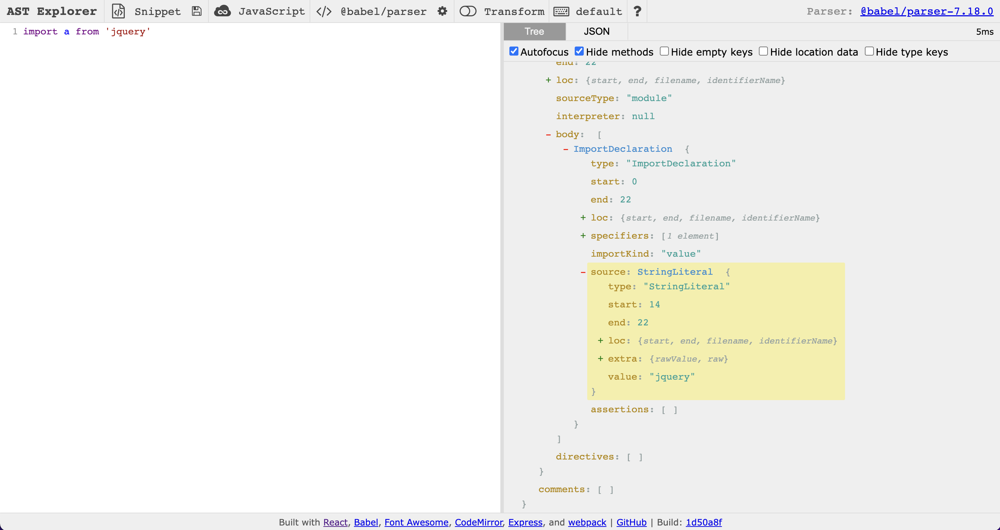

# 00后手写一个js打包器

## 1. 前言

  作为一名刚工作的前端萌新，我对 javaScript 文件的打包机制理解并不深刻，所以下面我将从一个初学者的角度来尝试手写一个简单的js打包器，附加心理路程。

## 2. 思路

  在手写一个js打包器之前，我先打开了webpack中文文档，下面这是文档的第一句。

  本质上，*webpack* 是一个现代 JavaScript 应用程序的*静态模块打包器(module bundler)*。当 webpack 处理应用程序时，它会递归地构建一个*依赖关系图(dependency graph)*，其中包含应用程序需要的每个模块，然后将所有这些模块打包成一个或多个 *bundle*。

  看完这句，思路是不是就来了？

  首先，我的目标并没有webpack那么伟大，我要做的只是一个js打包器，而不是一个模块打包器。而模块这一概念对应着webpack的loader机制【根据不同的文件类型，采取不同的loader，将其转译成webpack可读取的模块，这就意味着我们可以在javascript代码中以模块化的形式载入任意形式的资源文件，例如样式文件，css文件】

  同时，webpack可以实现分块打包，这样在浏览器首次渲染时可以先加载部分的js文件，剩下的js文件可以通过页面交互来获取，这种渐进式加载的思想很适合现代化的大型应用。考虑到作者水平有限，这个功能也不做了。

 那么，实现js打包器的主要问题就变成了 如何实现js文件的递归构建依赖关系图(dependency graph)？

## 3. 方案

**第1步**:  如何知道一个js文件中引入了哪些文件？  

下面是我的方案： 

<https://astexplorer.net/>

如下图所示，我想到先用babel parse 阶段的目的是把源码字符串转换成机器能够理解的 AST。

通过分析抽象语法树的结构来尝试获取import的文件路径。

```javascript
const dependencies = [];
traverse(ast, {
    ImportDeclaration: ({
      node
    }) => {
      dependencies.push(node.source.value)
    }
})
```




**第2步**:  dependencies依赖数组每一项对应着一个js文件的相对路径。

定义一个依赖关系图的结构【key为绝对路径，value值为资源对象】

然后通过递归函数，希望实现如下效果。


第三步：